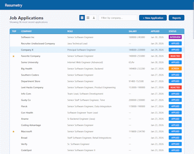
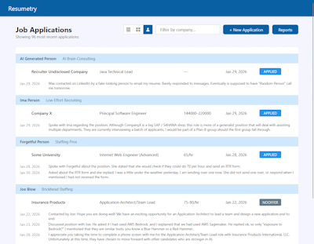
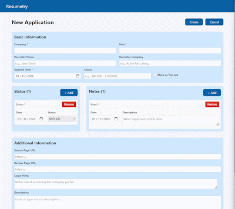
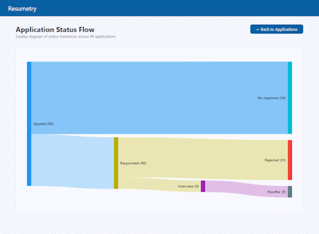

## Project Overview
Resumetry is an Angular 20 web application with a FastAPI Python serverless backend using Pydantic for model validation to handle API requests.

## Prerequisites
- Docker Desktop (or Docker Engine + Docker Compose)

### Build and Run with Docker Compose

```bash
# Build and start all services
docker-compose up -d

# Stop all services
docker-compose down
```

- Resumetry frontend will be available at: http://localhost:4200
- Swagger for the FastAPI is available at: http://localhost:8000/api/docs
- DynamoDB admin page is available at: http://localhost:8002

## What it does
- Track Job Applications that are submitted to companies.

[](assets/application-list.png)

- Switch to Recruiter view to track Jobs and conversations with recuiters.

[](assets/recruiter-view.png)

- Track Notes and Status changes that occur over time (Applied, Rejected, Screen, Interview, Offer, Withdrawl, NoOffer).

[](assets/application-form.png)

- Sankey report showing application status flow.

[](assets/sankey.png)

### Currently in Construction
- Login via OAUTH/OIDC using third party credentials (LinkedIn, Google, Etc..)
- Tenant partitioning via Login for individual users.

### Frontend Structure
```
frontend/src/app/
├── app.ts                    # Root component
├── app.routes.ts             # Route definitions (provideRouter)
├── main.ts                   # Bootstrap with bootstrapApplication()
├── core/
│   ├── models/               # Interfaces, enums, type definitions
│   └── services/             # Injectable services (HttpClient, signals)
└── features/
    ├── applications/         # Job application feature components
    │   ├── application-list/
    │   ├── application-detail/
    │   └── application-form/
    └── reports/              # Report components
        └── sankey-report/    
```

### Backend Structure
```
backend/app/
├── main.py                 # FastAPI app + Lambda handler
├── config.py               # Settings via pydantic-settings
├── routers/
│   ├── health.py           # GET /health
│   └── api_v1.py           # GET /api/v1/ping
├── models/
│   ├── base.py             # Base Pydantic schema
│   ├── responses.py        # Response models
│   ├── enums.py            # ApplicationStatus enum
│   └── job_application.py  # Job application models
├── services/
│   └── job_application_service.py  # Job application service
└── db/
    └── dynamodb.py         # DynamoDB client and table setup
```